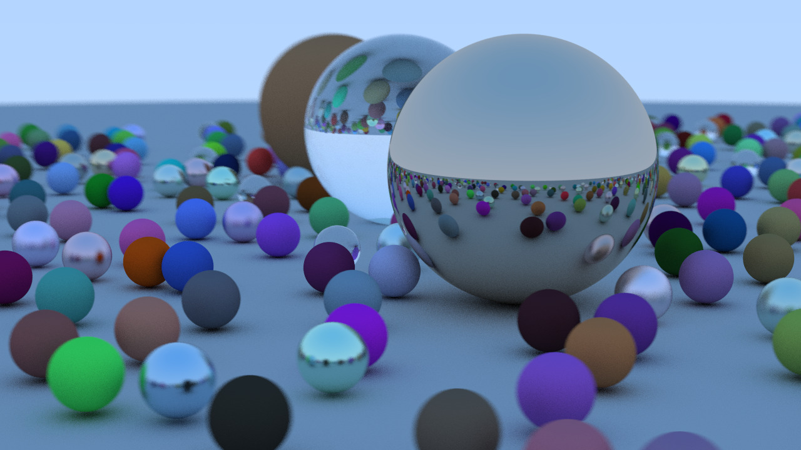

# raytra-c-e

[Based on Peter Shirly's Ray Tracing in One Weekend](https://raytracing.github.io/books/RayTracingInOneWeekend.html)

Work in progress.

## Dielectrics

---

## Positionable Camera

---

## Depth of Field

---

## Random Scene

